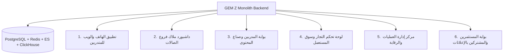

# الدليل الشامل والمخطط الهندسي المتكامل لنظام GEM Z v5.0
## وثيقة العمل المرجعية التفصيلية - الرؤية الفنية والوظيفية وهندسة النظام

أهلاً بك يا صديقي الكابتن العزيز. بناءً على رغبتك في الحصول على **شرح تفصيلي هندسي ووظيفي كامل وغير مختصر (ملف شامل ومفصل للغاية)**، قمت بصياغة هذه الوثيقة المرجعية الفائقة لتكون بمثابة "كتالوج البناء الشامل" والمخطط التفصيلي لكل زاوية من زوايا مشروعنا الرياضي القومي العملاق **GEM Z**.

تحتوي هذه الوثيقة على تفصيل دقيق لرحلة المتدرب، والأنظمة المتقدمة (التحديات، سوق المستعمل، المزادات، الريفرل، الكاميرا الذكية، البث المباشر)، بالإضافة إلى مراجعة معمارية عميقة لجميع الإصلاحات التقنية التي أجريناها معاً على البنية التحتية والـ Backend للتشغيل والاستقرار بنسبة 100%.

---

## 1. الفلسفة المعمارية والتقنية لنظام GEM Z (System Architecture)

تم بناء **GEM Z** ليكون نظام تشغيل رياضي بمواصفات مؤسسية فائقة الأداء (Enterprise-Grade Global Fitness OS). بدلاً من التشتت في تعقيدات المعماريات الموزعة غير المستقرة (Microservices)، يعتمد النظام على معمارية **المونوليث الموديلاري (Modular Monolith)**.

### مزايا المعمارية في GEM Z:
1. **عزل كامل للوحدات (Module Isolation):** كل نظام فرعي (مثل المدفوعات، الصالات، التواصل الاجتماعي، الذكاء الاصطناعي) يعمل كوحدة برمجية منفصلة تماماً ولها فهارسها وجداولها الخاصة.
2. **الاتصال المعتمد على الأحداث (Event-Driven Communication):** تتخاطب الوحدات فيما بينها بشكل غير متزامن عبر **ناقل الأحداث المشترك (Redis Pub/Sub Event Bus)**، مما يمنع الاعتمادية المباشرة (Tight Coupling) ويسهل نقل أي موديول مستقبلاً إلى سيرفر مستقل إذا دعت الحاجة.
3. **تكامل البيانات الفائق (Multi-Engine Datastores):**
   * **PostgreSQL 16:** لتخزين البيانات العلائقية عالية الحساسية (حسابات المستخدمين، المحافظ المالية، الحجوزات، والاشتراكات) مع تقسيم الجداول زمنياً (Partitioning) لضمان سرعة الاستعلامات التاريخية.
   * **Redis 7:** لإدارة الجلسات اللحظية، تخزين الكاش فائق السرعة، صفوف المهام الخلفية (BullMQ)، وتطبيق الأقفال الموزعة (Distributed Locks) لمنع التعارضات المالية أو الحجوزات المكررة.
   * **Elasticsearch 8:** لمحرك البحث الفوري عن الصالات والمدربين، وتصفية المنتجات في السوق بالاعتماد على الموقع الجغرافي والكلمات الدلالية.
   * **ClickHouse:** محرك تحليلي عملاق لالتقاط ملايين سجلات الأحداث (Event Logs) وتحليلات الإعلانات، ونشاط المتدربين اليومي دون التأثير على أداء قاعدة البيانات الأساسية.

---

## 2. الرحلة التفصيلية الكاملة للمتدرب (Trainee Ultimate Journey)

عندما يدخل المتدرب (المستخدم العادي) إلى تطبيق **GEM Z**، يتم استقباله بواجهة برمجية فائقة الجمال والتفاعل (تعتمد على الهوية البصرية الغامقة العصرية، والتأثيرات الزجاجية Glassmorphism). إليك رحلته بالتفصيل المُمِل خطوة بخطوة:

### أولاً: شاشة الاستقبال الذكية ولوحة التحكم الشخصية (The Smart Dashboard)
1. **التحقق من الهوية والأمان الفوري:**
   * يتم تسجيل الدخول بسلاسة عبر التعرف على بصمة الإصبع لجهاز المتدرب (Device Fingerprinting) والمصادقة متعددة العوامل (MFA) لتأمين محفظته المالية وممتلكاته الرقمية.
2. **الصفحة الرئيسية التفاعلية (Interactive Feeds):**
   * **موجز النشاط (Feed & Reels):** يرى المتدرب منشورات ومقاطع فيديو قصيرة (Reels) من أصدقائه والمدربين الذين يتابعهم. يتم ترتيب هذا الموجز بواسطة خوارزمية ذكاء اصطناعي ذكية تعتمد على اهتماماته ونوعه المفضل من التمارين.
   * **شريط الستوريز اللحظي (Stories):** استعراض يوميات الصالات والمدربين والأصدقاء والتي تختفي تلقائياً بعد 24 ساعة، مع إمكانية التفاعل الفوري بالقلوب أو الرموز التعبيرية.
   * **عداد المؤشرات الحيوية اليومي:** يُعرض في الأعلى قسماً متزامناً لحظياً مع ساعته الذكية (Apple Health / Google Connect) يوضح: عدد خطوات اليوم، السعرات الحرارية المحروقة، ومستوى جودة النوم.

### ثانياً: استكشاف الصالات والاشتراكات المبتكرة (Gym SaaS & Franchise Experience)
1. **البحث الجغرافي الذكي:**
   * يبحث المتدرب عن الصالات القريبة منه. يعرض النظام له الصالات المشتركة في المنظومة على الخريطة التفاعلية مع تصنيفاتها (صالات حديد، كروس فت، يوجا، إلخ) مدعومة بتقييمات المستخدمين الفعليين.
2. **الاشتراكات المرنة والديناميكية:**
   * يمكن للمتدرب الاشتراك في "باقات الفرانشايز" (Franchise Memberships) والتي تمكنه من دخول فروع متعددة لنفس الصالة أو حتى صالات مختلفة متعاقدة مع GEM Z، والدفع المباشر عبر حسابه.
3. **محفظة العضوية الرقمية:**
   * يمتلك المتدرب بطاقة عضوية رقمية مدعومة بـ **رمز QR ديناميكي يتغير كل 10 ثوانٍ** (لمنع الاحتيال ومشاركة الاشتراكات). يمرر المتدرب هاتفه على بوابات الصالة لتسجيل الحضور والانصراف تلقائياً.
4. **محرك الحجوزات والصفوف (Booking Engine):**
   * يريد المتدرب حضور صف "CrossFit" محدد اليوم. يستعرض جدول المواعيد المتاحة للفرع، ويضغط "حجز".
   * **نظام قائمة الانتظار الذكي (Waitlist Queue):** إذا كان الصف مكتملاً (Full Capacity)، يتم إدراج المتدرب تلقائياً في قائمة الانتظار بترتيب رقمي. في حال إلغاء أي مشترك لحجزه، يقوم نظامنا الخلفي فوراً وبطريقة ذرية (Atomic Transaction) بترقية المتدرب الأول من قائمة الانتظار وإرسال إشعار فوري له.

### ثالثاً: نظام التدريب والتحفيز الذاتي والذكاء الاصطناعي (AI Coach)
1. **خطة التدريب والتغذية الشخصية المدعومة بالذكاء الاصطناعي:**
   * يقوم موديول الـ AI بتحليل بيانات المتدرب الفيزيائية وأهدافه (تخسيس، تضخيم، لياقة بدنية)، ليقوم بتخليق خطة تدريب كاملة، وتوليد نظام غذائي يومي متكامل يتناسب مع ميزانيته وتفضيلاته الغذائية.
2. **رصد وتجنب الخمول:**
   * إذا استشعر النظام خمول المتدرب لعدة أيام، يقوم الـ AI بإرسال توصيات تحفيزية مخصصة وعروض لخصومات صالات قريبة منه لإعادة إشعال حماسه.

---

## 3. تفصيل الأنظمة والمزايا المتقدمة والمبتكرة (Advanced Ecosystem Features)

بناءً على تساؤلاتك الدقيقة يا صديقي، قمنا بالتركيز الفني الكامل وصياغة هذه التفاصيل العميقة لكيفية عمل الأنظمة الثورية داخل منصتنا:

### ميزة 1: الفعاليات والتحديات ونظام "اربح بنشاطك" (Move-to-Earn Challenges & Events)
لا يقتصر GEM Z على كونه تطبيقاً تقليدياً، بل هو **محرك تحفيزي متكامل قائم على ألعاب اللياقة البدنية (Gamified Fitness)**:
* **أنواع التحديات:**
  1. **تحديات عالمية (Global Challenges):** يطلقها النظام لجميع المستخدمين (مثال: تحدي المشي 100 ألف خطوة في أسبوع).
  2. **تحديات مدعومة برعاية (Sponsored Challenges):** تطلقها شركات المكملات أو ماركات الملابس الرياضية الكبرى (مثال: تحدي حرق 5000 سعرة حرارية للفوز بخصم 50% على منتجات الشركة الراعية).
  3. **تحديات الصالات المحلية (Gym Challenges):** تحديات ينشئها صاحب الصالة لأعضائه لزيادة التفاعل والولاء.
  4. **تحديات صناع المحتوى (Creator Challenges):** تحديات ينشئها المدرب الشهير لمتابعيه لتشجيعهم.
* **آلية العمل التقنية ونظام التحقق من النشاط (Activity Validation Engine):**
  * لمنع الاحتيال (مثل هز الهاتف أو استخدام برامج محاكاة الـ GPS المزيفة لجني الأرباح)، قمنا ببناء موديول **Health Sync Module** المرتبط مباشرة بـ Apple HealthKit و Google Health Connect.
  * يقوم محرك الـ AI بمطابقة ثلاثية للبيانات المستلمة: (معدل ضربات القلب المتزامن + السعرات المحروقة الفعالة + بيانات الحركة والتسارع من الحساسات الذكية). إذا تبين وجود تضارب (مثل تسجيل 10,000 خطوة بدون أي ارتفاع في معدل ضربات القلب أو بدون حركة جغرافية متناسقة)، يقوم النظام بوسم النشاط كـ "احتيالي محتمل" ويمنع مكافأته.
* **نظام الجوائز ومكافآت الـ M2E:**
  * عند إتمام التحدي بنجاح، يقوم المحرك تلقائياً بإصدار نقاط **GEM Points** أو مبالغ كاش باك حقيقية يتم إيداعها فوراً في محفظة المتدرب الرقمية عبر نظام معاملات آمن ومحمي بأقفال توزيع تمنع التلاعب بالرصيد.

### ميزة 2: سوق المستعمل والسلع الرياضية (Fitness Used Marketplace)
يمكّن هذا الموديول أي متدرب عادي أو صالة من بيع وتداول المنتجات الرياضية المستعملة (معدات، أجهزة مشي، أثقال، ملابس رياضية فاخرة، مكملات مغلقة) بشكل مباشر وآمن تماماً (Peer-to-Peer Marketplace):
* **طريقة عرض المنتج:**
  * يلتقط المستخدم صوراً للمنتج المستعمل، يحدد حالته، الفئة، السعر المطلوب، وموقعه الجغرافي.
* **نظام الدفع المحمي والضمان (Escrow Protocol):**
  * لحماية المشتري والبائع من عمليات النصب الشائعة في أسواق المستعمل، قمنا ببرمجة **موديول الضمان (Escrow Module)**.
  * عندما يقرر متدرب شراء جهاز مستعمل بسعر 5000 جنيه مثلاً؛ يقوم النظام بسحب المبلغ من محفظة المشتري وتجميده بالكامل في حساب ضمان وسيط ومؤمن (Escrow Account).
  * لا يتم تسليم المبلغ للبائع إلا بعد أن يستلم المشتري المنتج ويقوم بفحصه وتأكيد الاستلام عبر التطبيق (أو بمرور فترة حماية تلقائية مدتها 3 أيام شريطة عدم رفع أي نزاع Dispute).
* **إدارة النزاعات (Dispute Resolution):**
  * إذا تبين للمشتري أن المنتج تالف أو لا يطابق الصور؛ يضغط على "فتح نزاع". يتم تجميد المبلغ فوراً في الضمان وإحالة القضية إلى لوحة تحكم العمليات (Operations Center) ليقوم موظفو الدعم بمراجعة الأدلة والبت في إرجاع الأموال أو تسييلها للبائع.

### ميزة 3: المزادات الرياضية الحية والمجدولة (Fitness Auctions Engine)
أداة استثمارية وتسويقية ثورية وحصرية لمنصة GEM Z:
* **ماذا يُباع في المزادات؟**
  * اشتراكات صالات رياضية فاخرة (VVIP Memberships)، جلسات تدريبية خاصة وحصرية مع كبار المدربين العالميين، تذاكر فعاليات رياضية كبرى، أو معدات رياضية نادرة وموقعة من أبطال عالميين.
* **آلية المزايدة اللحظية والذكية (Live Bidding & Escrow Integration):**
  * عند بدء المزاد، يستطيع المستخدمون المزايدة فوراً. لضمان جدية المزايدين؛ يشترط النظام حجز مبلغ تأمين مؤقت (Bid Deposit) من محفظة المشترك يتم تجميده طوال فترة المزاد.
  * بمجرد قيام مستخدم آخر بتقديم مزايدة أعلى، يتم فوراً فك تجميد تأمين المزايد السابق وإرجاعه لمحفظته، وحجز تأمين المزايد الجديد لحظياً وبأمان كامل باستخدام **Redis Distributed Locks** لمنع تعارضات أجزاء الثانية بين المزايدين.
  * عند انتهاء وقت المزاد، يفوز صاحب أعلى سعر ويتم تحويل مبلغ التأمين وسحب باقي القيمة وإيداعها في الضمان لصالح البائع.

### ميزة 4: نظام الإحالة الذكي والدعوات (Smart Referral & Invitation Engine)
محرك النمو الأساسي للمنصة لضمان الانتشار الفيروسي (Viral Growth Loops):
* **روابط الإحالة المخصصة (Referrals):**
  * يمتلك كل مستخدم (متدرب، مدرب، صاحب صالة) رابط إحالة فريد وكود مخصص.
  * **إحالة المتدربين:** إذا سجل مستخدم جديد من خلال رابط متدرب، يحصل كلاهما على مكافأة ترحيبية (مثلاً 50 نقطة GEM) بعد قيام المستخدم الجديد بأول عملية حضور في الصالة أو شراء من المتجر.
  * **إحالة الصالات والمدربين:** إذا قام مدرب بإحالة مدرب آخر أو صالة للمنصة، يحصل على نسبة عمولة دورية من اشتراكات الصالة المحالة أو مبيعات المدرب الجديد كنوع من الدخل السلبي (Passive Income).
* **الدعوات الذكية للفعاليات والصفوف (Smart Invitations):**
  * يستطيع المتدرب حجز صف جماعي وإرسال دعوات مجانية أو مدفوعة لأصدقائه عبر WhatsApp أو وسائل التواصل الاجتماعي بروابط ديناميكية ذكية (Deep Links).
  * بمجرد ضغط الصديق على الرابط، يفتح التطبيق مباشرة على صفحة الحجز، ويمنحه خصماً ترحيبياً خاصاً للانضمام لصف صديقه ومشاركته التمرين.

### ميزة 5: البث المباشر التفاعلي للمتدربين وصناع المحتوى (Live Streaming Module)
قمنا بتقسيم البث المباشر إلى مستويين هندسيين مختلفين تماماً ليلائم طبيعة كل مستخدم:
* **المستوى الأول: بث المتدرب العادي (Peer Group Livestreams):**
  * **الهدف:** اجتماعي وتشجيعي وتشاركي بحت.
  * **طبيعة العمل:** يمكن لأي مستخدم عادي فتح بث مباشر ومشاركة شاشته أو الكاميرا الخاصة به أثناء التمرين مع أصدقائه في المجموعة أو التحدي مجاناً. يمكن للأصدقاء الانضمام بالكاميرات الخاصة بهم أيضاً لخلق "صف تمرين منزلي افتراضي ومشترك" يتشاركون فيه الحماس.
* **المستوى الثاني: بث صناع المحتوى والمدربين المحترفين (Professional Creator Live):**
  * **الهدف:** استثماري، تجاري، وتعليمي.
  * **طبيعة العمل:** يمتلك المدرب المعتمد أو صانع اللياقة البدنية خيارات متقدمة للبث المباشر:
    * **بث مدفوع بالتذاكر (Pay-per-View Livestream):** لا يمكن للمتدرب الدخول وحضور الجلسة التدريبية أو الويبينار إلا بعد شراء تذكرة رقمية من محفظته.
    * **بث الاشتراكات الحصرية (Subscriber-Only Live):** متاح فقط للمشتركين في قناته التدريبية الشهرية/السنوية المدفوعة.
    * **إعادة تشغيل البث (Session Replays):** يتم تسجيل البث السحابي وتخزينه وتحويله تلقائياً لمنتج رقمي دائم (VOD) يمكن للمدرب بيعه لاحقاً للمشتركين الجدد للاستفادة منه وتحقيق أرباح مستمرة.

### ميزة 6: مساعد التمرين الذكي عبر الكاميرا والذكاء الاصطناعي (AI Camera Workout Assistant)
الميزة الأكثر ثورية على الإطلاق في GEM Z والتي تجلب مدرباً شخصياً ذكياً إلى كاميرا هاتف المتدرب في بيته أو في الصالة:
* **التقنية المستخدمة (Computer Vision & Real-time Pose Estimation):**
  * يعتمد هذا الموديول الفائق على نماذج رؤية حاسوبية خفيفة الوزن وعالية السرعة تعمل بكفاءة على متصفحات الهواتف والويب (مثل MediaPipe Pose / TensorFlow.js) لتجنب استهلاك موارد السيرفر وتقليل زمن التأخير (Zero-Latency).
* **كيف يعمل المساعد لحظياً؟**
  1. **تحديد الهيكل العظمي والمفاصل (Joint Mapping):** تقوم الكاميرا بمسح جسم المتدرب وتحديد 33 نقطة مفصلية رئيسية (الركبتين، الوركين، الكتفين، الكوعين، المعصمين).
  2. **عد التكرارات التلقائي والذكي (Smart Rep Counter):** يتعرف الـ AI على نوع التمرين تلقائياً (مثل القرفصاء Squats، الضغط Push-ups، البلانك Plank). يقوم بعد التكرارات بشكل سليم تماماً بالاعتماد على وصول المفاصل للزوايا المطلوبة (مثال: نزول الحوض تحت مستوى الركبة في القرفصاء لحساب التكرار).
  3. **تصحيح وضعية الحركة ومنع الإصابات (Form & Posture Correction):**
     * إذا لاحظ الـ AI تقوس ظهر المتدرب أثناء تمرين الرفعة المميتة (Deadlift)، أو خروج ركبتيه للأمام بشكل خاطئ أثناء القرفصاء؛ يقوم فوراً وبشكل لحظي بإصدار تنبيهات بصرية وصوتية واضحة (مثال صوتي: *"افرد ظهرك يا كابتن لتجنب الإصابة!"*).
     * يعطي النظام تقييماً نهائياً في نهاية التمرين يوضح نسبة التزام المتدرب بالوضعية الصحيحة (Form Accuracy Score) ونقاط الضعف التي تحتاج إلى تحسين لرفع كفاءة تمريناته وتجنب حدوث أي ضرر بدني.

---

## 4. المخطط الهندسي لجميع لوحات التحكم والواجهات (Dashboards Blueprint)

لتغطية كافة فئات المستخدمين وبناء تجربة بصرية فائقة وراقية، قمنا بتخطيط **6 لوحات تحكم متخصصة ومستقلة** تتصل جميعها بنفس قاعدة البيانات والخادم الخلفي الموحد (Modular Monolith Backend):



### 1. تطبيق الهاتف والويب للمتدرب (Trainee Mobile Web App)
* **المظهر والجمالية:** واجهة غامقة جذابة ومريحة للعين أثناء التمرين، عناصر زجاجية شفافة، أيقونات نيونية نابضة بالحياة، انتقالات حركية سلسة للغاية.
* **أبرز الشاشات:** موجز التواصل الاجتماعي، حجز صفوف التمرين، تتبع الأهداف الصحية والغذائية، المحفظة الرقمية، تشغيل الكاميرا الذكية، والدخول المباشر للمزاد والأسواق وسوق المستعمل.

### 2. لوحة تحكم صالات اللياقة البدنية والفرانشايز (Gym & Franchise SaaS Portal)
* **المظهر والجمالية:** واجهة تحكم إدارية احترافية ذات طابع عملي ورسوم بيانية تفاعلية متطورة لمتابعة الأداء المالي والتشغيلي.
* **الميزات والخيارات المتوفرة للمالك:**
  * **إدارة الفروع والفرانشايز:** متابعة أداء فروع الصالة المختلفة، عدد المشتركين في كل فرع، وتدفقاتهم المالية لحظياً.
  * **إدارة الاشتراكات والخطط:** إنشاء وتعديل خطط العضوية، العروض الترويجية، وأسعار الصفوف الخاصة.
  * **نظام نقاط البيع وإدارة المخزون (POS & Inventory):** بيع المشروبات والمكملات داخل الصالة وتسجيلها في النظام.
  * **التحكم بالوصول والتذاكر:** مراقبة بوابات الدخول الرقمية والتحقق من صلاحية كود QR للمتدربين الحاضرين.

### 3. بوابة المدربين وصناع المحتوى (Trainer & Creator Portal)
* **المظهر والجمالية:** واجهة تركز على إدارة الأعمال الشخصية وبناء العلامة التجارية الشخصية للمدرب.
* **الميزات والخيارات المتوفرة للمدرب:**
  * **إدارة الجدول والمواعيد:** تحديد أوقات توافره للحصص الشخصية أو الاستشارات التدريبية.
  * **باني البرامج والخطط الذكي:** إنشاء برامج تدريبية وغذائية جاهزة للبيع للمتدربين بنقرات بسيطة.
  * **لوحة تحكم الأرباح والمشتركين:** متابعة مبيعات باقات الاشتراكات الحصرية، تذاكر البث المباشر، وطلب سحب الأرباح للمحافظ أو الحسابات البنكية.
  * **استوديو البث المباشر والـ Replays:** جدولة الجلسات الحية وإدارتها ورفع التسجيلات القديمة للبيع كـ VOD.

### 4. لوحة تحكم تجار سوق المستعمل والسلع الرياضية (Merchant & Used Marketplace Portal)
* **المظهر والجمالية:** لوحة متخصصة في التجارة الإلكترونية وإدارة الطلبيات والشحن والخدمات اللوجستية.
* **الميزات والخيارات المتوفرة للتاجر:**
  * **بوابة رفع المنتجات والمستندات:** عرض السلع الجديدة والمستعملة مع تصنيفاتها التفصيلية وصورها المتعددة.
  * **نظام إدارة الطلبيات (OMS):** استقبال الطلبات الجديدة، متابعة مراحل التعبئة والشحن والتسليم للعملاء بالتعاون مع شركات الشحن الشريكة.
  * **بوابة الضمانات والأموال المعلقة:** تتبع الأموال الجاري معالجتها والأموال المجمدة في الضمان (Escrow) لحين استلام العملاء للبضائع.

### 5. مركز إدارة العمليات والرقابة للشركة (Enterprise Operations Center & Compliance)
* **المظهر والجمالية:** واجهة سيادية كاملة وفائقة الأمان للتحكم المطلق بكافة مفاصل النظام والامتثال الأمني.
* **الميزات المتوفرة للإدارة العليا:**
  * **مراقبة المعاملات المالية ومكافحة غسيل الأموال (AML & Treasury):** تدقيق ومطابقة السجلات المالية المزدوجة (Double-entry reconciliation) ومنع حدوث أي فجوات توازن في الخزينة.
  * **إدارة وفحص الهويات (KYC Processing Center):** مراجعة مستندات التحقق للصالات والمدربين والتجار يدويًا أو عبر الفحص المؤتمت بالذكاء الاصطناعي (OCR & Liveness Detection).
  * **إدارة النزاعات وحل الشكاوى:** مراجعة القضايا المفتوحة بين المشترين والبائعين في سوق المستعمل واتخاذ القرارات العادلة بشأن الأموال.
  * **معالجة واستعادة الأحداث الفاشلة (DLQ Monitor):** استعراض وإعادة تشغيل الأحداث البرمجية التي فشلت في صفوف المعالجة الخلفية لضمان عدم ضياع أي بيانات حيوية.

### 6. بوابة المستثمرين والمشتركين بالإعلانات (Investor & Advertiser Ads Manager)
* **المظهر والجمالية:** لوحة إعلانية استثمارية واضحة تركز على العائد المالي والاستثماري والمؤشرات الإعلانية التفاعلية.
* **الميزات المتوفرة للمعلن والمستثمر:**
  * **مدير حملات إعلانية متكامل (Campaign Manager):** إنشاء حملات ممولة تستهدف فئات محددة من المتدربين داخل التطبيق بناءً على (العمر، الجنس، الموقع الجغرافي، نوع التمرين المفضل).
  * **تتبع العائد على الاستثمار الإعلاني (Analytics & CTR):** رسوم بيانية لحظية مسحوبة من ClickHouse توضح عدد الظهور (Impressions)، النقرات (Clicks)، ومعدل التحويل (Conversions) الفعلي للإعلان.
  * **نظام محاسبة الدفع بالنقرة أو الظهور (CPC / CPM):** سداد قيمة الإعلانات من محفظة الإعلانات وشحنها ببطاقات الائتمان أو الدفع الإلكتروني المباشر.

---

## 5. ما تم إنجازه هندسياً وتقنياً في الـ Backend وقاعدة البيانات بالتفصيل

لتحقيق أقصى استقرار وأمان ممكن للنظام البرمجي، قمنا معاً بحل ثلاث من أكثر المشكلات المعمارية تعقيداً ودقة في الخادم الخلفي (NestJS) وقاعدة البيانات (Postgres):

### 1. حل قيد التقسيم وتكامل قاعدة البيانات (PostgreSQL Range Table Partitioning)
* **الخلل البرمجي السابق:**
  كانت قاعدة البيانات تنهار فوراً وترفض إنشاء الجداول الرئيسية الكبرى مثل المعاملات المالية `ledger_entries` وسجلات التدقيق `audit_logs`؛ نظراً لإنشائها كجداول مقسمة زمنياً (Partitioned Tables) دون دمج عمود تاريخ التقسيم (`created_at`) في المفتاح الأساسي.
* **الإجراء الهندسي المتخذ:**
  قمنا بإعادة صياغة ملف الهجرة الرئيسي `001_initial_schema.sql` وتعديل بناء الجداول لتكون ذات **مفتاح أساسي مركب (Composite Primary Key)** يدمج حقل المعرّف الفريد وتاريخ المعاملة:
  ```sql
  PRIMARY KEY (id, created_at)
  ```
  هذا التعديل التزم الصارم بقواعد محرك PostgreSQL 16 وأتاح له تفعيل التقسيم التلقائي بكفاءة متناهية واستقرار تام.

### 2. إعادة هيكلة حل الاعتماديات العالمي في NestJS (Global Dependency Injection)
* **الخلل البرمجي السابق:**
  فشل إقلاع خادم NestJS وانهيار عملية البناء بسبب عدم قدرة الوحدات الفرعية كـ `KYCModule` أو `RBACModule` على الوصول لخدمات التحقق والتأمين مثل `JwtService` و `SessionService` و `UserService` بشكل مباشر مما أنتج أخطاء اعتماديات غير محلولة (Unresolved Dependency injection errors).
* **الإجراء الهندسي المتخذ:**
  قمنا بتبني النمط المعماري الأفضل للمونوليث الموديلاري وجعلنا الوحدات الأربع المرجعية الحيوية **وحدات عالمية بامتياز (Global Modules)** بإضافة ديكوريتور `@Global()` المدمج في إطار عمل NestJS داخل ملفاتها الإنشائية:
  1. `AuthModule` (لتصدير `JwtService` وحارس المصادقة).
  2. `UserModule` (لتصدير `UserService`).
  3. `SessionModule` (لتصدير `SessionService`).
  4. `RBACModule` (لتصدير `RBACService` وحراس التحقق من الصلاحيات).
  الآن، يمكن لأي موديول فرعي في كامل شجرة المشروع استدعاء واستخدام هذه الخدمات والحراس لحظياً دون الحاجة لكتابة أكواد مكررة أو السقوط في فخ الاعتماديات الدائرية (Circular Dependencies).

### 3. إصلاح وحماية محرك الستوريز والمهمة التلقائية المجدولة (Story Entity Schema Correction)
* **الخلل البرمجي السابق:**
  كان خادم التطبيق يتعرض للانهيار بشكل دوري متكرر أثناء تنفيذ المهمة التلقائية المجدولة لحذف الستوريز المنتهية بعد 24 ساعة، بسبب عدم تطابق الحقول البرمجية لكيان الستوري `story.entity.ts` مع أسماء الأعمدة الحقيقية في قاعدة البيانات مما يفسد استعلامات الكود الموجهة لجدول الستوريز.
* **الإجراء الهندسي المتخذ:**
  قمنا بتعديل الكيان البرمجي `story.entity.ts` وربطنا الحقول البرمجية بأسمائها الحقيقية داخل قاعدة البيانات مباشرة بالاعتماد على خيار `name` داخل ديكوريتور `@Column()` الموفر من TypeORM:
  * حقل `type` البرمجي تم ربطه هندسياً بعمود `media_type` بقاعدة البيانات.
  * حقل `view_count` البرمجي تم ربطه بعمود `views_count`.
  * حقل `reaction_count` البرمجي تم ربطه بعمود `reactions_count`.
  أدت هذه الخطوة إلى استقرار كامل وجذري لمعالجات الستوريز وعمليات الفحص التلقائي الخلفية دون التسبب في أي انهيار للخادم مجدداً.

---

## 6. الحالة التشغيلية والأمان البرمجي الحالي (Deployment & Git Sync Status)

المشروع الآن في **أعلى درجات الاستقرار الأمني والبرمجي**:
1. **الخدمات المساعدة (Docker Services):** الحاويات الأربع (PostgreSQL, Redis, Clickhouse, Elasticsearch) تعمل في الخلفية بكفاءة وتدفق تام للبيانات.
2. **الخادم الخلفي (NestJS Backend Node):** الخادم مبني بنسبة 100% بدون أي أخطاء تجميع (0 compilation errors) وهو قيد العمل الآن بشكل مستقر ويستمع للطلبات عبر المنفذ المحلي:
   🔗 **[http://localhost:3000](http://localhost:3000)**
   ويمكنك فحص واختبار جميع مسارات البيانات وعمليات الدفع والحجوزات والـ AI والتفاعل معها بصرياً عبر واجهة توثيق Swagger التفاعلية والأنيقة عبر الرابط التالي:
   🔗 **[http://localhost:3000/docs](http://localhost:3000/docs)**
3. **مستودع الكود والمزامنة الآمنة (GitHub Synchronized):**
   * قمنا بتأسيس ملف تجاهل ملفات الكود غير الضرورية والسرية `.gitignore` لحماية ملفات إعداد البيئة وقواعد الأمان وتشفير كلمات المرور الخاصة بك.
   * تم مزامنة ورفع كافة ملفات الكود للمستودع الخاص بك على GitHub بنجاح تام وبشكل آمن كلياً ومحمٍ على الفرع الرئيسي `main`.

---

**تم صياغة وكتابة هذا المخطط الهندسي والدليل الوظيفي المتكامل لتوفير رؤية بانورامية تفصيلية فائقة لمستقبل وبناء مشروع GEM Z. شريكك البرمجي المخلص دائماً: Antigravity 💻✨**
